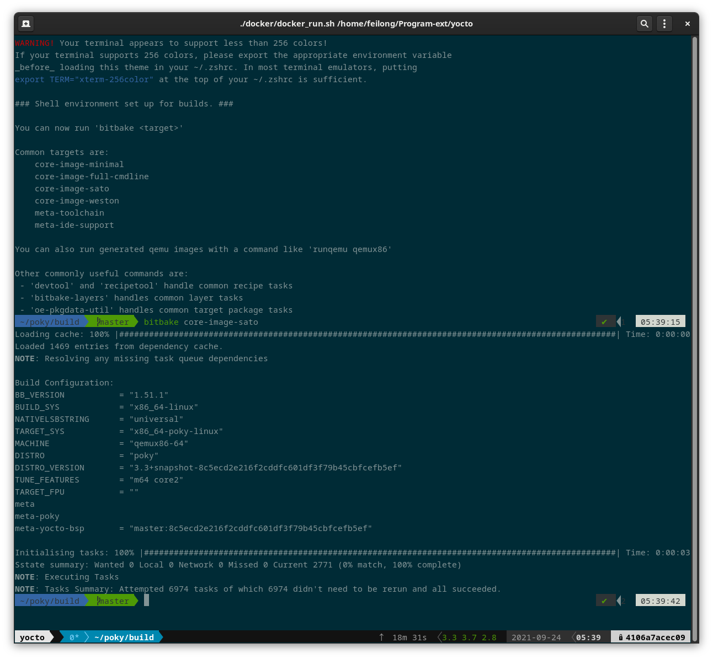

# yocto builder

> docker file to build `yocto`
>
> `zsh` and `tmux` is included.



## example

```
docker run -it --rm --name yocto_builder -v /home/feilong/Program-ext/yocto/poky:/home/yocto/poky yoctobuilder
```

## tips

### fix error of BBLAYERS not exist.

#### error message

```
ERROR: The following layer directories do not exist:
ERROR:    /home/yocto/poky/meta
ERROR:    /home/yocto/poky/meta-poky
ERROR:    /home/yocto/poky/meta-yocto-bsp
ERROR: Please check BBLAYERS in /home/feilong/Program-ext/yocto/poky/build/conf/bblayers.conf
```

#### fix method

```
pushd conf  # goto poky/build/conf
cp bblayers.conf bblayers.conf.real
mv bblayers.conf bblayers.conf.docker
vim bblayers.conf.real # cheange path of val `BBLAYERS`
ln -sf bblayers.conf.real bblayers.conf # set bblayers.conf to real machine
# ln -sf bblayers.conf.docker bblayers.conf # set bblayers.conf to docker
```
